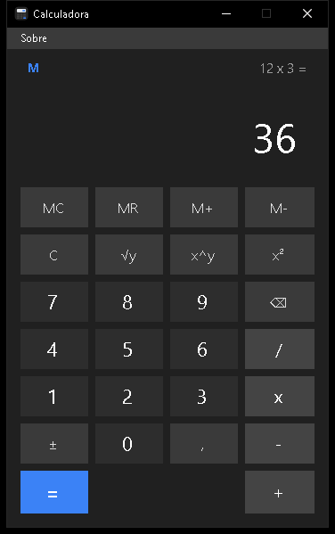
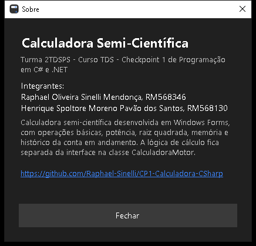

# Calculadora Semi-Científica

**Raphael Oliveira Sinelli Mendonça, RM568346**
**Henrique Spoltore Moreno Pavão dos Santos, RM568130**

Turma 2TDSPS, curso de Tecnologia em Análise e Desenvolvimento de Sistemas (TDS).
Disciplina de Programação em C# e .NET, Checkpoint 1.
Professor Dr. Marcel Stefan Wagner.

## Descrição do projeto

Aplicação Windows Forms que implementa uma calculadora semi-científica, com as quatro
operações básicas, potência, raiz quadrada, memória de um valor e histórico da conta em
andamento. Toda a lógica de cálculo fica separada da interface, em uma classe própria que
não conhece nenhum controle de tela.

## Funcionalidades

- Botões de 0 a 9, com visor alinhado à direita.
- Operações básicas: soma (+), subtração (-), multiplicação (x) e divisão (/).
- Três botões científicos: raiz quadrada (√y), potência (x^y) e ao quadrado (x²).
  O enunciado do checkpoint pede três botões específicos mas só descreve o funcionamento
  de dois deles (√y e x^y). O terceiro botão escolhido pelo grupo foi x² (elevar ao
  quadrado), por ser uma operação científica simples de completar o conjunto.
- Memória com MC (limpar), MR (recuperar), M+ (somar) e M- (subtrair), com um indicador
  "M" que aparece no visor quando há algum valor guardado.
- Botão de igual (=) que mostra o resultado e pode ser repetido para repetir a última
  operação, como na calculadora do Windows.
- Botão C que limpa o visor, os operandos e a operação pendente, sem afetar a memória.
- Contas encadeadas (2 + 3 + 4 = 9), com cálculo do resultado parcial ao trocar de operador.
- Trocar de operador antes de digitar o segundo número apenas substitui a operação.
- Botão de vírgula decimal, sem permitir mais de uma vírgula por número.
- Sem zeros à esquerda ("007" vira "7").
- Botão ⌫ para apagar o último dígito digitado.
- Botão ± para inverter o sinal do número atual.
- Divisão por zero e raiz de número negativo mostram uma mensagem de erro no visor, sem
  travar a aplicação. O próximo dígito digitado reinicia a calculadora normalmente.
- Resultados formatados em cultura pt-BR, sem lixo de ponto flutuante (0,1 + 0,2 mostra
  0,3) e com notação científica para números muito grandes.
- Linha de histórico acima do visor, mostrando a conta em andamento.
- Suporte completo a teclado (ver tabela de atalhos abaixo).
- Menu "Sobre" com os dados do grupo e o link deste repositório.
- Tema escuro inspirado na calculadora do Windows 11, com efeito hover nos botões e
  janela de tamanho fixo com ícone próprio.

## Tecnologias

- C# 12 / .NET 8 (net8.0-windows)
- Windows Forms
- Visual Studio 2022

## Estrutura de pastas e classes

```
Calculadora.sln
Calculadora/
  Calculadora.csproj
  Program.cs                    Ponto de entrada da aplicação
  Operacao.cs                   Enum com as operações que podem ficar pendentes
  Memoria.cs                    Memória da calculadora (MC, MR, M+, M-)
  CalculadoraMotor.cs           Toda a lógica matemática e o estado da conta
  FormCalculadora.cs            Interface e eventos da tela principal
  FormCalculadora.Designer.cs   Construção dos controles da tela principal
  FormSobre.cs                  Interface e eventos da tela Sobre
  FormSobre.Designer.cs         Construção dos controles da tela Sobre
  TemaEscuroMenu.cs             Paleta de cores do menu (MenuStrip)
  Resources/calculadora.ico     Ícone da aplicação
```

A separação entre lógica e interface segue o seguinte princípio: `CalculadoraMotor` e
`Memoria` não têm nenhuma referência a `System.Windows.Forms`, apenas cálculo e estado.
`FormCalculadora` cuida somente da interface e dos eventos dos botões e do teclado,
delegando toda conta ao motor.

## Como executar

### Visual Studio 2022

1. Abra o arquivo `Calculadora.sln`.
2. Defina o projeto `Calculadora` como projeto de inicialização (já vem configurado).
3. Pressione F5 para compilar e executar.

### dotnet CLI

```
dotnet build Calculadora.sln
dotnet run --project Calculadora/Calculadora.csproj
```

## Prints

As imagens abaixo ficam na pasta `docs/prints`:





## Atalhos de teclado

| Tecla | Ação |
|---|---|
| 0 a 9 (linha superior ou numérico) | Dígitos |
| + - * / (numérico ou digitados) | Operações básicas |
| Enter | Igual (=) |
| Backspace | Apagar último dígito (⌫) |
| Esc | Limpar (C) |
| , ou . | Vírgula decimal |
